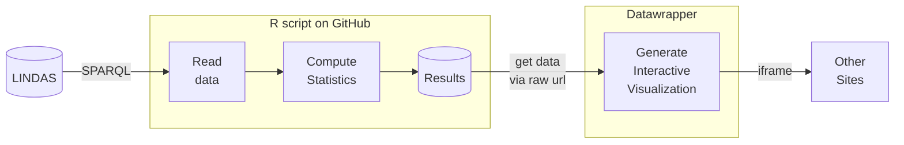

> [!NOTE]
> This GitHub repository is used as a proof-of-concept and does not contain any official statistics from the federal office for agriculture.

# Process documentation

For this proof-of-concept, the following pipeline is tested:

- The federal office for agriculture FOAG uploads up-to-date market data into the linked data service LINDAS.
- The R script `main.R` executes a SPARQL query (saved in `sparql-scripts/query.rq`) and receives the data from LINDAS.
- The R script `main.R` calculates the producer's share of the comsumer's price and performs a seasonal decomposition. The results of this computation is saved in the `data` folder.
- A separately set-up visualization task in [Datawrapper](https://www.datawrapper.de/) pulls its source data from the same URL, always: The `data/producers-share.csv` table. It generates an interactive chart that can be accessed [via another URL](https://datawrapper.dwcdn.net/hdlcx/5/).
- The html-page `docs/index.html` embedds the Datawrapper-visualization using an iframe.

# What is LINDAS and linked data?

This repository contains a collection of scripts for querying LINDAS (linked data service).

With LINDAS (Linked Data Service), public administrations can publish their data in the form of Knowledge Graphs and make them accessible via <https://lindas.admin.ch>. Data users can then access these data through a variety of means. LINDAS is operated by the Swiss Federal Archives and includes various elements of the data lifecycle.

Linked Data is a technology that allows data to be easily interrelated in a universal form - hence the name *Linked Data*. These can be data from a variety of subject areas and origins.
