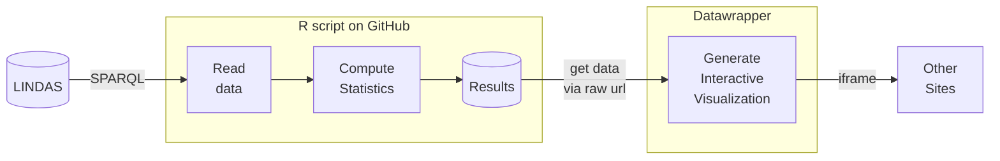

> [!NOTE]
> This GitHub repository is used as a proof-of-concept and does not contain any official statistics from the federal office for agriculture.

# 🎯 Goal of this project

The goal of this project is to develop and test a proof-of-concept (POC) data pipeline that involves the following steps:

1. **Data querying:** An R script, executed via GitHub Actions, queries the data from LINDAS using SPARQL. The Federal Office for Agriculture (FOAG) already uploads current market data to the [Linked Data Service](https://lindas.admin.ch/) (LINDAS).
2. **Computation:** The script calculates the producer's share of the consumer's price and performs a seasonal decomposition. The results are stored on this public GitHub repository.
3. **Visualization:** The results are visualized using [Datawrapper](https://www.datawrapper.de/), which generates an interactive chart embedded in an [HTML page](https://blw-ofag-ufag.github.io/poc-producers-share/).

# 🤖 The tech stack

This project makes use of the following technologies and programming languages.

- **SPARQL:** A query language and protocol for Linked Open Data on the web, for example LINDAS, a linked data service for publishing data as knowledge graphs.
- **R:** Handles data querying and computation.
- **GitHub Actions:** Automates the execution of the R script.
- **Datawrapper:** Creates and displays interactive visualizations.

# Process documentation

For this proof-of-concept, the following pipeline is tested:

- The federal office for agriculture FOAG uploads up-to-date market data into the linked data service LINDAS.
- The R script `main.R` executes a SPARQL query (saved in `sparql-scripts/query.rq`) and receives the data from LINDAS.
- The R script `main.R` calculates the producer's share of the comsumer's price and performs a seasonal decomposition. The results of this computation is saved in the `data` folder.
- A separately set-up visualization task in [Datawrapper](https://www.datawrapper.de/) pulls its source data from the same URL, always: The `data/producers-share.csv` table. It generates an interactive chart that can be accessed [via another URL](https://datawrapper.dwcdn.net/hdlcx/5/).
- The html-page `docs/index.html` embedds the Datawrapper-visualization using an iframe.



# 🖥️ The GitHub Actions workflow


```yml

```
