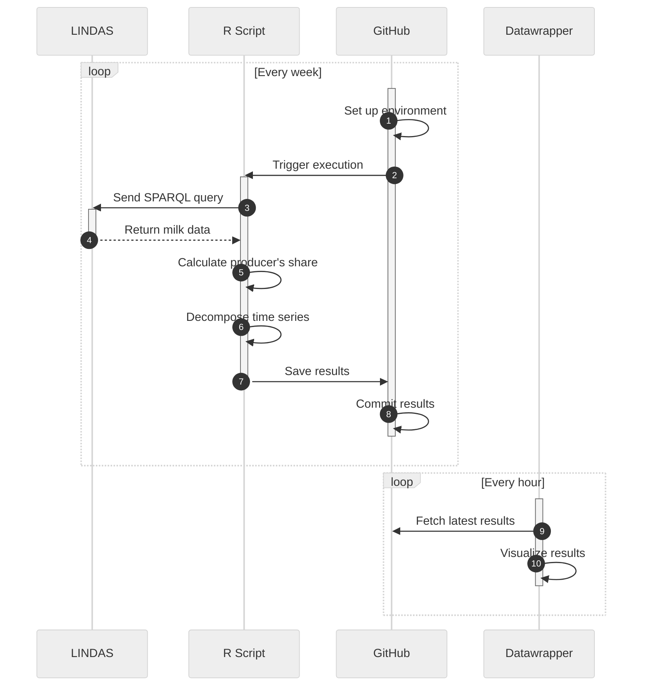

> [!NOTE]
> This GitHub repository is used as a proof-of-concept and does not contain any official statistics from the federal office for agriculture.

# 🎯 Goal of this project

The goal of this project is to develop and test a proof-of-concept (POC) data pipeline that involves the following steps:

1. **Data querying:** An R script, executed via GitHub Actions, queries the data from LINDAS using SPARQL. The Federal Office for Agriculture (FOAG) already uploads current market data to the [Linked Data Service](https://lindas.admin.ch/) (LINDAS).
2. **Computation:** The script calculates the producer's share of the consumer's price and performs a seasonal decomposition. The results are stored on this public GitHub repository.
3. **Visualization:** The results are visualized using [Datawrapper](https://www.datawrapper.de/), which generates an interactive chart embedded in an [HTML page](https://blw-ofag-ufag.github.io/poc-producers-share/).

# 🤖 The tech stack

This project makes use of the following technologies and programming languages.

- **LINDAS:** A linked data service for publishing data as knowledge graphs. It can be queries by SPARQL, a query language and protocol for linked open data on the web.
- **R:** A language for statistical computing.
- **GitHub Actions:** A CI/CD platform that allows to automate code execution.
- **Datawrapper:** A no-code tool to create and displays interactive visualizations.

# 📓 Process documentation

This project involves two periodically executed processes: the GitHub Actions workflow (once a week) and the Datawrapper update (once an hour). Below is a detailed description of the process, with reference to the actual step numbers from the sequence diagram.



1. **Set up environment:** GitHub Actions sets up the environment, installing R and the necessary packages `httr` as well as `readr`.
2. **Trigger execution:** GitHub Actions triggers the execution of the R script (`main.R`).
3. **Send SPARQL query:** The R script sends a SPARQL query to LINDAS via the API to retrieve the latest market data.
4. **Return market data:** LINDAS processes the query and returns the up-to-date milk data to the R script.
5. **Calculate producer's share:** The R script computes the producer's share of the consumer's price based on the returned data.
6. **Decompose time series:** The R script performs a seasonal decomposition of the time series by LOESS (locally estimated scatterplot smoothing) using the `stl` function from the `stats` package.
7. **Save results:** The processed results are written as two CSV files (`prices.csv` and `producers-share.csv`) to the `/results` directory.
8. **Commit results:** GitHub Actions commits the results to the repository. If no changes are detected, no commits are made.
9. **Fetch latest results:** Datawrapper periodically (every hour) fetches the latest results from a fixed URL in the GitHub repository.
10. **Visualize results:** Datawrapper creates and updates an interactive graphic at a fixed URL, reflecting the latest processed data. A demo of the datawrapper visualizations can be seen [here](https://blw-ofag-ufag.github.io/poc-producers-share/). Note that the Datawrapper visualization is integrated in this webpage as an iframe.

# 🖥️ The GitHub Actions workflow

The GitHub action is controlled by the yaml file `.github/workflow/compute-producers-share.yml`. The action is scheduled to run every Sunday at midnight UTC.

```yml
on:
  schedule:
    - cron: '0 0 * * 0'
jobs:
  compute-producers-share:
    runs-on: ubuntu-latest
    steps:
      - name: Set Up R
        uses: r-lib/actions/setup-r@v2
      - name: Install packages
        uses: r-lib/actions/setup-r-dependencies@v2
        with:
          packages: |
            any::httr
            any::readr
      - name: Check out repository
        uses: actions/checkout@v3
      - name: Compute producer's share
        run: Rscript -e 'source("main.R")'
      - name: Commit results
        run: |
          git config --local user.email "actions@github.com"
          git config --local user.name "GitHub Actions"
          git add .
          git commit -m 'Data updated' || echo "No changes to commit"
          git push origin || echo "No changes to commit"
```
